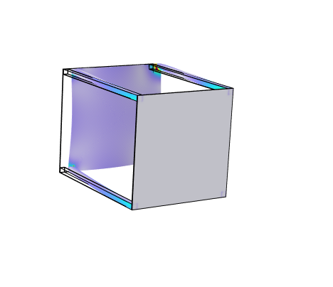
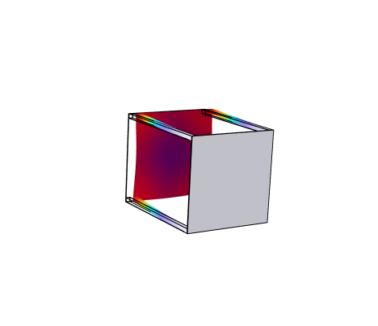
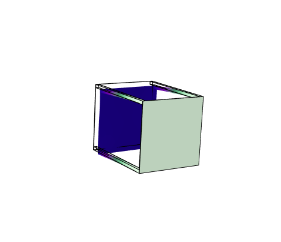

# Spacecraft Structural Design and Launch Load Verification

Preliminary structural design and finite-element assessment of an aluminium spacecraft bus subjected to representative launch loads.

The project combines SolidWorks CAD modelling with COMSOL Multiphysics analysis to investigate static strength, mesh convergence, combined axial and lateral loading, structural displacement and linear buckling.

> This is a preliminary engineering study and does not represent formal spacecraft qualification or flight certification.
> 

## Project objectives

- Develop a simplified spacecraft primary-structure CAD model.
- Apply representative axial and lateral launch loads.
- Investigate finite-element mesh convergence.
- Separate mesh-sensitive corner stresses from representative structural stresses.
- Estimate yield factors of safety.
- Perform a linear eigenvalue buckling assessment.
- Identify limitations and recommend further verification work.

## Structural concept

The spacecraft structure consists of:

- Four hollow aluminium corner rails.
- Two structural plates.
- A rectangular bus approximately `0.7 × 0.7 × 0.912 m`.
- A total spacecraft design mass of `60 kg`.

The structural components were modelled using aluminium 7075-T6.

| Property | Analysis input |
|---|---:|
| Young's modulus | 71.7 GPa |
| Poisson's ratio | 0.33 |
| Density | 2810 kg/m³ |
| Assumed yield strength | 503 MPa |

## Load cases

### Axial launch load

- Acceleration: `6g` in the negative y-direction.
- Distributed equipment force: `2401 N`.
- Launch-interface face fixed.
- Purpose: baseline axial compression assessment.

### Combined launch load

- Axial acceleration: `6g`.
- Lateral acceleration: `2g` in the positive x-direction.
- Axial equipment force: `2401 N`.
- Lateral equipment force: `800.4 N`.
- Purpose: coupled axial and lateral launch-load assessment.

### Linear buckling

A linear eigenvalue buckling study was performed using the axial reference loading.

## Mesh convergence

Four tetrahedral meshes were evaluated.

| Mesh | Elements | Corner peak stress | Maximum displacement | Stress 10 mm inward |
|---|---:|---:|---:|---:|
| Coarse | 111,085 | 426.45 MPa | 7.6233 mm | 76.392 MPa |
| Normal | 146,772 | 466.59 MPa | 7.6385 mm | 80.832 MPa |
| Fine | 168,747 | 490.65 MPa | 7.6549 mm | 79.276 MPa |
| Finer | 339,028 | 582.09 MPa | 7.6705 mm | 81.337 MPa |

The maximum corner stress continued to increase with mesh refinement, indicating a stress singularity caused by the idealised load and boundary-condition intersection.

Stress was therefore evaluated at a fixed point 10 mm inward from the corner:

```text
x = 0.305 m
y = 0.906 m
z = -0.305 m
```

The representative stress changed by approximately 2.5% between the Fine and Finer meshes, while maximum displacement changed by approximately 0.20%.

## Axial-load results

| Result | Value |
|---|---:|
| Representative von Mises stress | 81.337 MPa |
| Maximum displacement | 7.6705 mm |
| Yield factor of safety | 6.18 |
| Mesh-sensitive corner peak | 582.09 MPa |

The factor of safety was calculated using the representative stress:

```text
FoS = 503 / 81.337 = 6.18
```

The corner peak was not used for the margin calculation because it did not converge with mesh refinement.

## Combined-load results

| Result | Value |
|---|---:|
| Representative von Mises stress | 119.78 MPa |
| Maximum displacement | 15.401 mm |
| Yield factor of safety | 4.20 |
| Mesh-sensitive corner peak | 699.06 MPa |

The representative yield factor of safety remained positive:

```text
FoS = 503 / 119.78 = 4.20
```

The displacement result requires comparison with future payload-alignment, interface and clearance requirements.



The capped plot improves the visibility of the global stress distribution. It does not alter the calculated solution.



## Linear buckling results

| Mode | Load factor |
|---:|---:|
| 1 | 19.011 |
| 2 | 19.011 |
| 3 | 36.722 |
| 4 | 52.110 |
| 5 | 52.153 |
| 6 | 52.155 |

The first ideal linear buckling factor is `19.011`. Applied proportionally to the 6g reference load, this corresponds to an idealised threshold of approximately `114g`.



This is a preliminary linear result. It does not include geometric imperfections, material nonlinearity, detailed joint flexibility or launcher-interface compliance.

## Main conclusions

- Global displacement and representative stress showed good mesh stability.
- The loaded boundary corner produced a non-convergent stress singularity.
- The axial representative yield factor of safety was `6.18`.
- The combined-load representative yield factor of safety was `4.20`.
- The first ideal linear buckling load factor was `19.011`.
- The concept is suitable for continued preliminary development.
- The analysis is not a formal structural qualification.

## Recommended further work

- Model fasteners, contacts and rail-to-panel joints.
- Replace the fully fixed interface with representative launcher-adapter stiffness.
- Perform geometrically nonlinear buckling with imperfections.
- Apply approved material allowables and programme-specific safety factors.
- Define and verify payload displacement and alignment requirements.
- Investigate modal frequencies, random vibration and launch shock.

## Repository structure

```text
Spacecraft_Structural_Design
├── CAD
│   ├── SolidWorks part files
│   └── SolidWorks assembly files
├── COMSOL
└── README.md — model files excluded due to GitHub's file-size limit
├── Results
│   ├── Combined_Load_Displacement.png
│   ├── Combined_Load_Stress_Capped_150MPa.png
│   ├── Combined_Load_Stress_Full_Range.png
│   ├── Fine_Mesh_168747_Elements.png
│   └── First_Buckling_Mode_Load_Factor_19.011.png
├── Report
│   └── Spacecraft_Structural_Launch_Load_Verification_Report.pdf
├── .gitignore
└── README.md
```

## Software

- COMSOL Multiphysics 6.3
- SolidWorks
- Microsoft Excel
